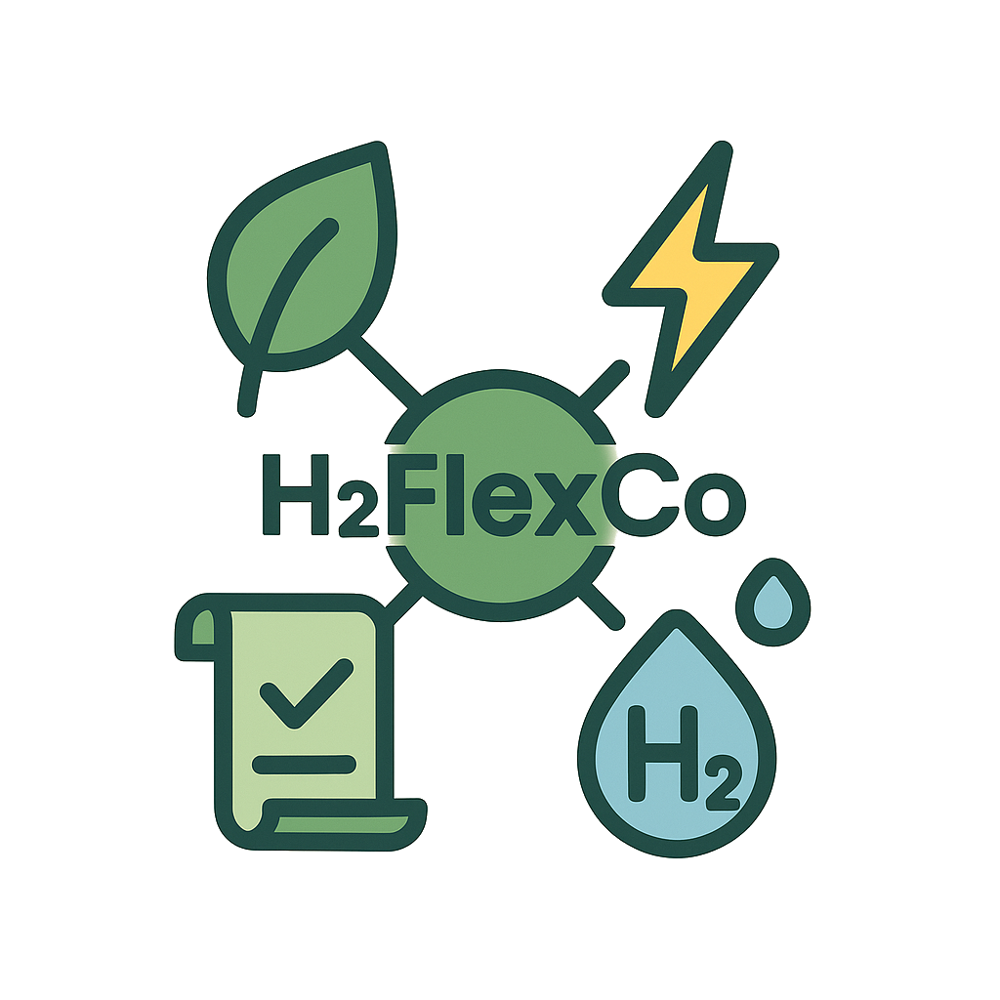

<p align="center">
  
</p>

# Operational Planning of Hydrogen-Centric Companies

This repository accompanies the paper ‘**A Portfolio-Level Optimization Framework for Coordinated Market Participation and Operational Scheduling of Hydrogen-Centric Companies**’, presented at the 2025 IEEE International Conference on Energy Technologies for Future Grids. It has been developed as part of the **WinHy** project, funded by the Dutch Research Council (NWO) and Repsol S.A.
It provides the implementation of a portfolio-level optimization framework for hydrogen-centric companies that simultaneously operate across electricity, hydrogen, and green certificate markets. The model is designed to co-optimize operational scheduling and market participation for geographically distributed assets, including electrolyzers, renewable generation units, and energy storage systems. The framework is formulated as a Mixed-Integer Linear Programming (MILP) model and implemented in Python (Pyomo), with openly available datasets and case studies.

## 📂 Files

- `H2FlexCo.ipynb`: Main Jupyter Notebook with the optimization model.
- `SimData.xlsx`: Excel file containing the input simulation data.
- `requirements.txt`: List of required Python packages.

## 🚀 Requirements

Install the necessary Python libraries using:

```bash
pip install -r requirements.txt
```

## 📈 How to Run

1. Open `H2FlexCo.ipynb` in Jupyter Notebook or JupyterLab.
2. Ensure `SimData.xlsx` is in the same directory as the notebook.
3. Run all cells in the notebook to execute the model and generate results.

## 📦 Dependencies

The code uses the following libraries:
- `pyomo`
- `pandas`
- `numpy`
- `matplotlib`
- `seaborn`
- `pickle`

You may also need a solver like GLPK or IPOPT for Pyomo.

<!-- ## 📚 Citations
If you use this repository in your work, please cite: -->

## 📝 License

MIT License.
