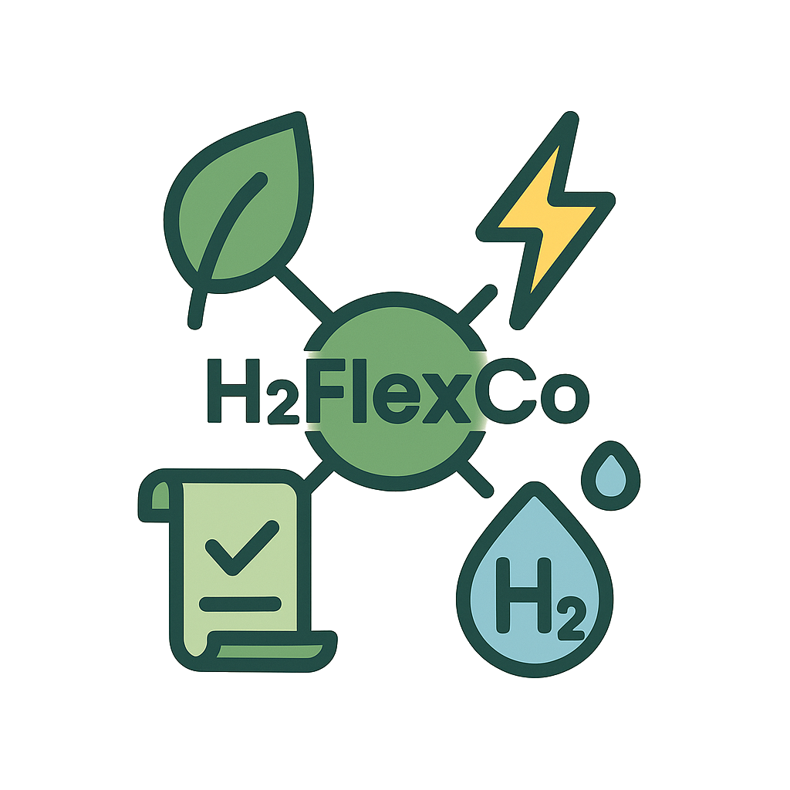

<p align="center">
  
</p>

# Operational Planning of Hydrogen-Centric Companies

This repository accompanies the paper "A Portfolio-Level Optimization Framework for Coordinated Market Participation and Operational Scheduling of Hydrogen-Centric Companies," presented at the 2025 IEEE International Conference on Energy Technologies for Future Grids. The work was developed as part of the WinHy project, funded by the Dutch Research Council (NWO) and Repsol S.A.

## Description

This repository contains the implementation of a portfolio-level optimization framework for hydrogen-centric companies operating across electricity, hydrogen, and green certificate markets at the same time. The model co-optimizes operational scheduling and market participation for geographically distributed assets, including electrolyzers, renewable generation units, and energy storage systems. It's formulated as a Mixed-Integer Linear Program (MILP) and implemented in Python (3.12.5) inside a Jupyter Notebook, using Pyomo.

## Key features

- Co-optimizes participation in electricity, hydrogen (bundled and unbundled), and green certificate markets at the same time.
- Coordinates flexibility across a portfolio of distributed sites, rather than optimizing each asset on its own.
- Supports both physical and virtual Power Purchase Agreements (PPAs), including take-as-produced structures.
- Enforces company-level green hydrogen targets, certification rules, and clean energy temporal matching constraints.
- Works for hydrogen-centric companies of different sizes and under different operational scenarios.

## Model

The model plans day-ahead operation. The objective maximizes total company profit, accounting for hydrogen sales revenue, certificate transactions, electricity market exchanges, and PPA settlements. It captures asset-level technical constraints (electrolyzers, energy storage, renewable generation) and allows comparing per-site versus portfolio-level compliance strategies.

## Case study

The framework is demonstrated on a representative hydrogen-centric company (H2FLEX) operating five sites across Spain. Three operational setups are compared:

- **Case 1** – each electrolyzer operates independently, with its own PPA and its own green hydrogen target constraint.
- **Case 2** – PPAs are dispatched centrally across electrolyzers by the company operator, but green hydrogen targets are still enforced per site.
- **Case 3** – both PPAs and green hydrogen targets are managed at the portfolio level by the company operator.

Across these cases, centralized coordination increases hydrogen production and lowers daily operational costs compared to decentralized operation, and portfolio-level enforcement of green hydrogen targets gives more flexibility than enforcing them per site, without breaking certification compliance.

## Repository structure

```
├─ H2FlexCo.ipynb                # Main notebook with the optimization model
├─ H2FlexCo.py                   # Script version of the main notebook
├─ SimData.xlsx                  # Input simulation data
├─ requirements.txt              # Python package requirements
├─ LICENSE                       # MIT License
├─ Logo.png                      # Repository logo
├─ Cases/
│  ├─ Case_1.ipynb               # Decentralized site-level operation
│  ├─ Case_2.ipynb               # Centralized PPA dispatch
│  ├─ Case_3.ipynb               # Full portfolio-level coordination
│  └─ SimData.xlsx               # Input data for the case studies
```

## Requirements

```bash
pip install -r requirements.txt
```

You'll also need the GLPK solver for Pyomo, since the model is a MILP.

## How to run

Open `H2FlexCo.ipynb` in Jupyter Notebook or JupyterLab, make sure `SimData.xlsx` is in the same folder, and run all cells.

For the individual case studies, open the corresponding notebook under `Cases/` (`Case_1.ipynb`, `Case_2.ipynb`, or `Case_3.ipynb`) and run all cells — each one reads `SimData.xlsx` from within that same folder.

## Citation

If you use this repository, please cite:

Mansouri, S. A., & Bruninx, K. (2025). A Portfolio-Level Optimization Framework for Coordinated Market Participation and Operational Scheduling of Hydrogen-Centric Companies. IEEE International Conference on Energy Technologies for Future Grids.

## License

MIT License.
